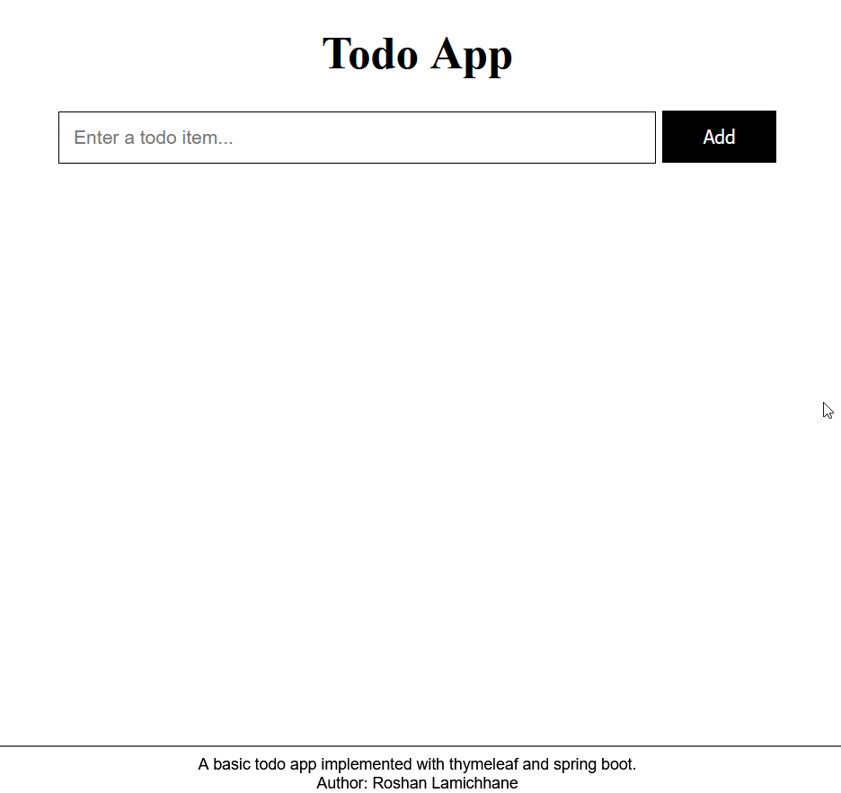

## Basic Todo App with Thymeleaf (Project- 01)
A basic todo app implemented using Thymeleaf and spring boot as a learning project.

Uses:
- Postgres
- Thymeleaf

### References
- https://github.com/bezkoder/spring-boot-thymeleaf-example 
- https://spring.io/guides/gs/serving-web-content/

### Screenshots
